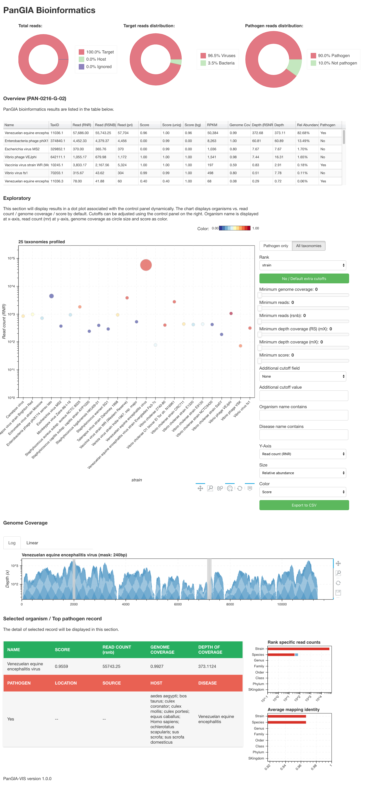

# PanGIA Bioinformatics

The bioinformatics pipeline leverages BWA/Minimap2 to identify ‘where’ reads belong to provides taxonomy identification specific to strain-level. Other than community profiling, PanGIA uses two approaches to obtain a metric of confidence, one that relies on uniqueness of sequences and the other one that relies on comparing test samples with control samples (organism-basis).

The software associated a web-based user interface for job submission in docker and interactive result visualization for providing pathogenic information and real-time filtering results. The pipeline was tested and validated using many synthetic datasets ranging in community composition and complexity, and was successfully applied to spiked clinical samples.

The docker version is also available at [Docker hub](https://hub.docker.com/r/poeli/pangia). The docker container runs PanGIA-UI that provides a web-based GUI to facilitate users to analyze their datasets through PanGIA and access to results.

<p align="center"></p>

-------------------------------------------------------------------
## REQUIREMENT

Third-party softwares:

* Python >= 3.4
* BWA >= v0.7
* Minimap2 >= 2.1
* samtools >= 1.8
* GNU parallel

PanGIA requires following Python dependencies:

* Pandas >= 0.22
* SciPy >= 0.14
* Bokeh >= 0.13 (optional)

------------------------------------------------------------------
## DOWNLOAD DATBASE

PanGIA Database can be downloaded from LANL:
```
https://edge-dl.lanl.gov/PanGIA/database/
```

1. Download taxonomy and pathogen metadata:
    * [metadata-latest.tar.gz](https://edge-dl.lanl.gov/PanGIA/database/PanGIA_20180915_taxonomy.tar.gz)

2. Download BWA index(es) for reference genomes:
    * NCBI Refseq89 reference and representative genomes -- Bacteria/Archaea/Viruses (BAV) [[tar]](https://edge-dl.lanl.gov/PanGIA/database/PanGIA_20180915_NCBI_genomes_refseq89_BAV.fa.tar)
    * NCBI Refseq89 complete genomes of CDC biothreat agents (adds) [[tar]](https://edge-dl.lanl.gov/PanGIA/database/PanGIA_20180915_NCBI_genomes_refseq89_adds.fa.tar)
    * (Optional) NCBI Refseq89 genomes of Plasmodium [[tar]](https://edge-dl.lanl.gov/PanGIA/database/PanGIA_20180915_NCBI_genomes_refseq89_Plasmodium.fa.tar)

3. (Optional) Download BWA indexes for host genomes:
    * Human genome GRCh38.p12 [[tar]](https://edge-dl.lanl.gov/PanGIA/database/PanGIA_20180915_NCBI_genomes_refseq89_Human_GRCh38.p12.fa.tar)
    * Human genome alternative assembly CHM1_1.1 [[tar]](https://edge-dl.lanl.gov/PanGIA/database/PanGIA_20180301_NCBI_genomes_refseq86_Human_CHM1_1.1.fa.tar)
    * JCVI human genome assembly [[tar]](https://edge-dl.lanl.gov/PanGIA/database/PanGIA_20180227_JCVI_human_genome.fa.tar)
    * Mosquitos genomes [[tar]](https://edge-dl.lanl.gov/PanGIA/database/PanGIA_20180301_NCBI_genomes_refseq86_mosquitos.fa.tar)

4. (Optional) Original sequences databases in FASTA format:
    * All raw sequences can be found [here](https://edge-dl.lanl.gov/PanGIA/database/FASTA/).

-------------------------------------------------------------------
## QUICK INSTALLATION

0. Make sure you have requirements and dependencies installed properly. [Conda](https://conda.io/miniconda.html) is quick way.

1. Retrieving PanGIA:
```
git clone https://github.com/poeli/pangia.git && cd pangia
```

2. Download databases:
```
curl -O https://edge-dl.lanl.gov/PanGIA/database/PanGIA_20180915_taxonomy.tar.gz
curl -O https://edge-dl.lanl.gov/PanGIA/database/PanGIA_20180915_NCBI_genomes_refseq89_BAV.fa.tar
curl -O https://edge-dl.lanl.gov/PanGIA/database/PanGIA_20180915_NCBI_genomes_refseq89_adds.fa.tar
curl -O https://edge-dl.lanl.gov/PanGIA/database/PanGIA_20180915_NCBI_genomes_refseq89_Human_GRCh38.p12.fa.tar
```

3. Decompress databases. All files will be decompressed to "pangia/database" directory.
```
tar -xzf PanGIA_20180915_taxonomy.tar.gz
tar -xzf PanGIA_20180915_NCBI_genomes_refseq89_BAV.fa.tar
tar -xzf PanGIA_20180915_NCBI_genomes_refseq89_adds.fa.tar
tar -xzf PanGIA_20180915_NCBI_genomes_refseq89_Human_GRCh38.p12.fa.tar
```
4. Enjoy.

-------------------------------------------------------------------
## EXAMPLE USAGE
```
./pangia.py \
  -i test.1.fastq test.2.fastq\
  -db database/NCBI_genomes_refseq89_*.fa  \
  -t 24
```

Run dataset HMP Mock Community even sample (SRR172902) against PanGIA NCBI refseq89 BAV and adds database with 24 threads, save mapping information to JSON file for use as a background later.

```
./pangia.py \
  -i SRR172902.fastq \
  -db database/NCBI_genomes_refseq89_BAV.fa database/NCBI_genomes_refseq89_adds.fa \
  -sb \
  -t 24
```

Run dataset "test.fq" against all PanGIA databases with 24 threads, load QCB_background_REP1 as background and report a "combined" score.

```
./pangia.py \
  -i HPV_test.fq \
  -db database/NCBI_genomes_*.fa \
  -lb background/QCB_background_REP1_allQC.pHostDB_NoHost.pangia.json.gz \
  -st combined \
  -t 24
```

-------------------------------------------------------------------
## QUICK PanGIA-VIS

0. PanGIA will cleanup the temp directory after the job is done. Run pangia.py with `--keepTemp` if you want PanGIA-VIS to display genome coverage plot.

1. Install Bokeh >= v1.0.
```
conda install -c bokeh bokeh
```
2. Run `pangia-vis.pl` with PanGIA result file (*.result.tsv). For example:
```
pangia-vis.pl pangia_vis/data/test.tsv
```
3. Enjoy!

-------------------------------------------------------------------
## REPORT

| COLUMN | NAME               | DESCRIPTION                                                                                          |
|--------|--------------------|------------------------------------------------------------------------------------------------------|
| 1      | LEVEL              | Taxonomic rank                                                                                       |
| 2      | NAME               | Taxonomic name                                                                                       |
| 3      | TAXID              | Taxonomic ID                                                                                         |
| 4      | READ_COUNT         | Number of raw mapped reads                                                                           |
| 5      | READ_COUNT_RNR     | Number of mapped reads normalized by shared reference                                                |
| 6      | READ_COUNT_RSNB    | Number of rank-specific mapped reads normalized by identity and # of shared reference                |
| 7      | LINEAR_COV         | Proportion of covered signatures to total signatures of mapped organism(s)                           |
| 8      | DEPTH_COV          | Depth of coverage                                                                                    |
| 9      | DEPTH_COV_NR       | Depth of coverage normalized by # of shared reference                                                |
| 10     | RS_DEPTH_COV_NR    | Depth of coverage calculated by rank-specific reads normalized by # of shared reference at this rank |
| 11     | PATHOGEN           | Pathogen or not                                                                                      |
| 12     | SCORE              | Confidence score                                                                                     |
| 13     | REL_ABUNDANCE      | Relative abundance                                                                                   |
| 14     | ABUNDANCE          | Abundance                                                                                            |
| 15     | TOTAL_BP_MISMATCH  | Total number of mismatch base-pairs                                                                  |
| 16     | NOTE               | Note                                                                                                 |
| 17     | RPKM               | Reads Per Kilobase Million                                                                           |
| 18     | PRI_READ_COUNT     | Number of reads mapped to this organism as a primary alignment                                       |
| 19     | TOL_RS_READ_CNT    | Total rank specific read count                                                                       |
| 20     | TOL_NS_READ_CNT    | Total rank non-specific read count                                                                   |
| 21     | TOL_RS_RNR         | Total rank specific read count                                                                       |
| 22     | TOL_NS_RNR         | Total rank non-specific read count                                                                   |
| 23     | TOL_GENOME_SIZE    | Total size of genome(s) belong to this taxa                                                          |
| 24     | LINEAR_LENGTH      | Number of non-overlapping bases covering the signatures                                              |
| 25     | TOTAL_BP_MAPPED    | Total bases of mapped reads                                                                          |
| 26     | RS_DEPTH_COV       | Depth of coverage calculated by rank-specific reads                                                  |
| 27     | FLAG               | Superkingdom flag                                                                                    |
| 38-36  | STR - ROOT         | Number of READ_COUNT at each rank (strain to root)                                                   |
| 37-45  | STR_rnb - ROOT_rnb | Number of READ_COUNT_RSNB at each rank (strain to root)                                              |
| 46-54  | STR_rnr - ROOT_rnr | Number of READ_COUNT_RNR at each rank (strain to root)                                               |
| 55-63  | STR_ri - ROOT_ri   | read-mapping identity at each rank (strain to root)                                                  |
| 64     | SOURCE             | Pathogenic - sample sources                                                                          |
| 65     | LOCATION           | Pathogenic - sample locations                                                                        |
| 66     | HOST               | Pathogenic - sample hosts                                                                            |
| 67     | DISEASE            | Pathogenic - diseases                                                                                |
| 68     | SCORE_UNIQ         | Score based on uniqueness information among genomes (overall)                                        |
| 69     | SCORE_BG           | Score based on comparing input dataset with input background                                         |
| 70     | SCORE_UNIQ_CUR_LVL | Score based on uniqueness information among genomes (rank)                                           |

-------------------------------------------------------------------
## USAGE

```
usage: pangia.py [-h] (-i [FASTQ] [[FASTQ] ...] | -s [SAMFILE])
                 [-d [[BWA_INDEX] [[BWA_INDEX] ...]]] [-dp [PATH]]
                 [-asl <INT>] [-ams <INT>] [-ao <STR>] [-se]
                 [-st {bg,standalone,combined}]
                 [-m {report,class,extract,lineage}]
                 [-rf {basic,r,rnb,rnr,ri,patho,score,ref,full,all} [{basic,r,rnb,rnr,ri,patho,score,ref,full,all} ...]]
                 [-da] [-par <INT>] [-xnm <INT>] [-x [TAXID]] [-r [FIELD]]
                 [-t <INT>] [-o [DIR]] [-td [DIR]] [-kt] [-p <STR>] [-ps]
                 [-sb] [-lb [<FILE> [<FILE> ...]]] [-ms <FLOAT>] [-mr <INT>]
                 [-mb <INT>] [-ml <INT>] [-mc <FLOAT>] [-md <FLOAT>]
                 [-mrd <FLOAT>] [-np] [-pd] [-if <STR>] [-nc] [-c] [--silent]
                 [--verbose] [--version]

PanGIA Bioinformatics 1.0.0

optional arguments:
  -h, --help            show this help message and exit
  -i [FASTQ] [[FASTQ] ...], --input [FASTQ] [[FASTQ] ...]
                        Input one or multiple FASTQ file(s). Use space to
                        separate multiple input files.
  -s [SAMFILE], --sam [SAMFILE]
                        Specify the input SAM file. Use '-' for standard
                        input.
  -d [[BWA_INDEX] [[BWA_INDEX] ...]], --database [[BWA_INDEX] [[BWA_INDEX] ...]]
                        Name/path of BWA-MEM index(es). [default: None]
  -dp [PATH], --dbPath [PATH]
                        Path of databases. If this option isn't specified but
                        a path is provided in "--database" option, this path
                        of database will also be used in dbPath. Otherwise,
                        the program will search "database/" in program
                        directory. [default: database/]
  -asl <INT>, --alignSeedLength <INT>
                        Minimum seed length uses in BWA-MEM [default: 40]
  -ams <INT>, --alignMinScore <INT>
                        Minimum alignment score (AS:i tag) for BWA-MEM
                        [default: 60]
  -ao <STR>, --addOptions <STR>
                        Additional options for BWA-MEM (no need to add -t)
                        [default: '-h150 -B2']
  -se, --singleEnd      Input single-end reads or treat paired-end reads as
                        single-end [default: False]
  -st {bg,standalone,combined}, --scoreMethod {bg,standalone,combined}
                        You can specify one of the following scoring method:
                        "bg"         : compare mapping results with the background;
                        "standalone" : score based on uniqueness;
                        "combined"       : bg * standalone;
                        [default: 'standalone']
  -m {report,class,extract,lineage}, --mode {report,class,extract,lineage}
                        You can specify one of the following output modes:
                        "report"  : report a summary of profiling result;
                        "class"   : output results of classified reads;
                        "extract" : extract mapped reads;
                        "lineage" : output abundance and lineage in a line;
                        Note that only results/reads belongs to descendants of TAXID will be reported/extracted if option [--taxonomy TAXID] is specified. [default: 'report']
  -rf {basic,r,rnb,rnr,ri,patho,score,ref,full,all} [{basic,r,rnb,rnr,ri,patho,score,ref,full,all} ...], --reportFields {basic,r,rnb,rnr,ri,patho,score,ref,full,all} [{basic,r,rnb,rnr,ri,patho,score,ref,full,all} ...]
                        You can specify following set of fields to display in the report:
                        "basic" : essential fields that will display in the reports;
                        "r"     : rank specific read count;
                        "rnb"   : rank specific read count normalized by 
                                  both identity and # of ref (1*identity/num_refs);
                        "rnr"   : rank specific read count normalized by 
                                  the number of references (1/num_refs);
                        "ri"    : rank specific read identity
                                  (mapped_length-nm)/read_length;
                        "patho" : metadata of pathogen;
                        "score" : detail score information;
                        "ref"   : mapped reference(s) and their locations
                        "full"  : display additional information
                        "all"   : display all of above;
                        [default: 'all']
  -da, --displayAll     Display all taxonomies including being filtered out
                        [default: None]
  -par <INT>, --procAltRefs <INT>
                        Process the number of different references in
                        alternative alignments [default: 30]
  -xnm <INT>, --extraNM <INT>
                        Process alternative alignments with extra number of
                        mismatches than primary alignment [default: 1]
  -x [TAXID], --taxonomy [TAXID]
                        Specify a NCBI taxonomy ID. The program will only
                        report/extract the taxonomy you specified.
  -r [FIELD], --relAbu [FIELD]
                        The field will be used to calculate relative
                        abundance. [default: DEPTH_COV]
  -t <INT>, --threads <INT>
                        Number of threads [default: 1]
  -o [DIR], --outdir [DIR]
                        Output directory [default: .]
  -td [DIR], --tempdir [DIR]
                        Default temporary directory [default:
                        <OUTDIR>/<PREFIX>_tmp]
  -kt, --keepTemp       Keep temporary directory after finishing the pipeline.
  -p <STR>, --prefix <STR>
                        Prefix of the output file [default:
                        <INPUT_FILE_PREFIX>]
  -ps, --pathoScoreOnly
                        Only calculate score for pathogen under '--scoreMethod
                        bg'
  -sb, --saveBg         Save current readmapping result in JSON to
                        <PREFIX>.json
  -lb [<FILE> [<FILE> ...]], --loadBg [<FILE> [<FILE> ...]]
                        Load one or more background JSON gzip file(s)
                        [default: None
  -ms <FLOAT>, --minScore <FLOAT>
                        Minimum score to be considered valid [default: 0]
  -mr <INT>, --minReads <INT>
                        Minimum number of reads to be considered valid
                        [default: 10]
  -mb <INT>, --minRsnb <INT>
                        Minimum number of reads to be considered valid
                        [default: 2.5]
  -ml <INT>, --minLen <INT>
                        Minimum linear length to be considered valid [default:
                        200]
  -mc <FLOAT>, --minCov <FLOAT>
                        Minimum linear coverage to be considered a valid
                        strain [default: 0.004]
  -md <FLOAT>, --minDc <FLOAT>
                        Minimum depth of coverage to be considered a valid
                        strain [default: 0.01]
  -mrd <FLOAT>, --minRsdcnr <FLOAT>
                        Minimum rank specific depth of coverage normalized by
                        the number of mapped references to be considered a
                        valid strain [default: 0.0009]
  -np, --nanopore       Input reads is nanopore data. This option is
                        equivalent to use [-oa='-h 150 -x ont2d' -ms 0 -mr 1
                        -mb 3 -ml 50 -asl 24 -ams 70]. [default: FALSE]
  -pd, --pathogenDiscovery
                        Adjust options for pathogen discovery. This option is
                        equivalent to use [-ms 0 -mr 3 -mb 1 -ml 50 -asl 24
                        -ams 50 -mc 0 -md 0 -mrd 0]. [default: FALSE]
  -if <STR>, --ignoreFlag <STR>
                        Ignore reads that mapped to the references that have
                        the flag(s) [default: None]
  -nc, --noCutoff       Remove all cutoffs. This option is equivalent to use
                        [-ms 0 -mr 0 -mb 0 -ml 0 -mc 0 -md 0 -mrd 0].
  -c, --stdout          Write on standard output.
  --silent              Disable all messages.
  --verbose             Provide verbose running messages and keep all
                        temporary files.
  --version             Print version number.
